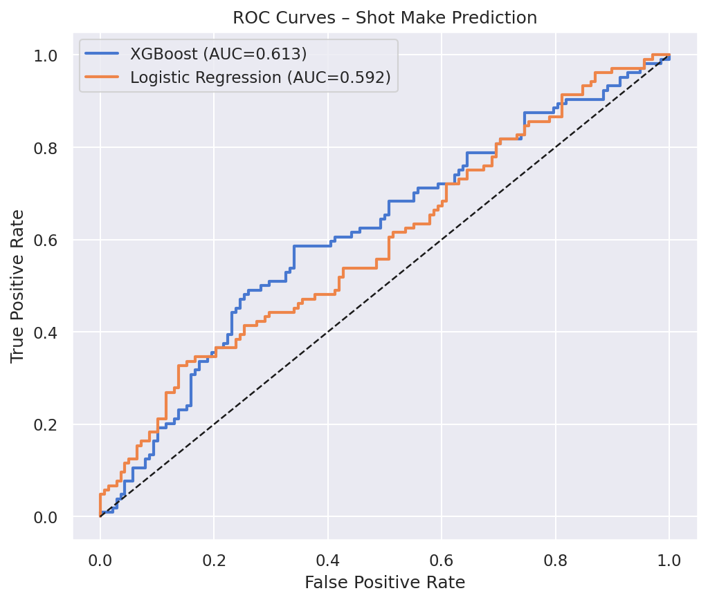
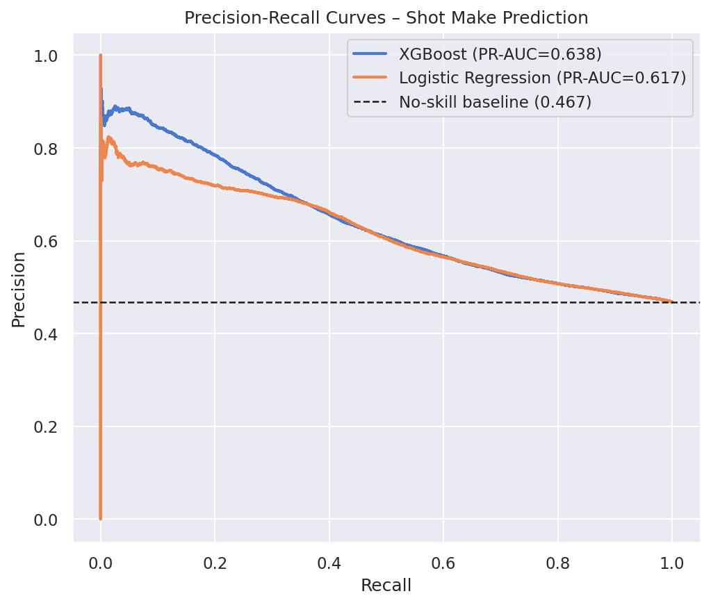
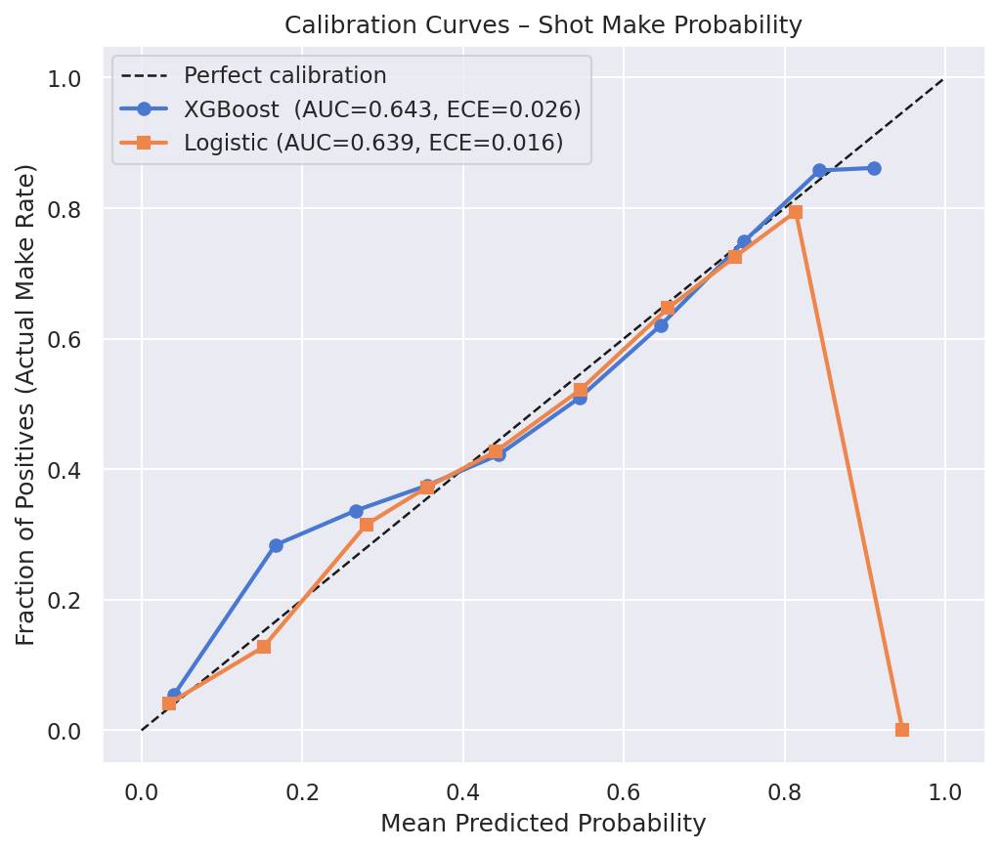
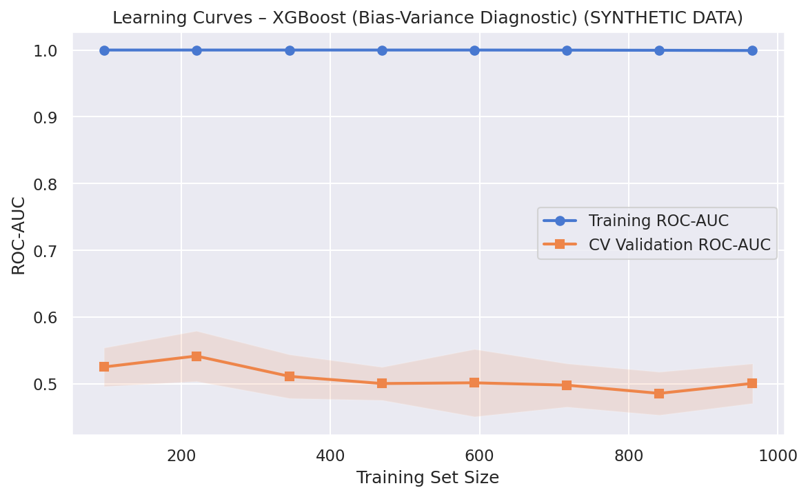
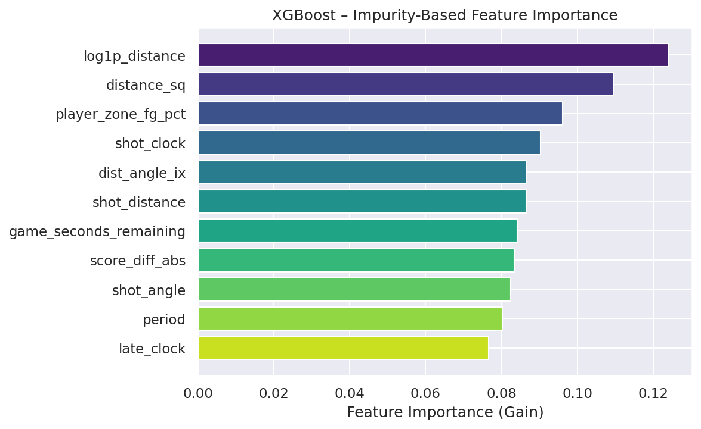
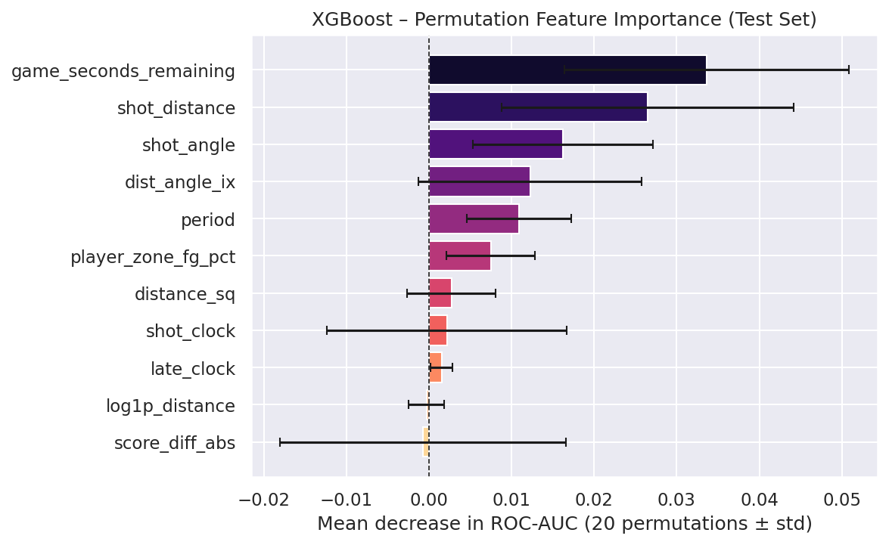
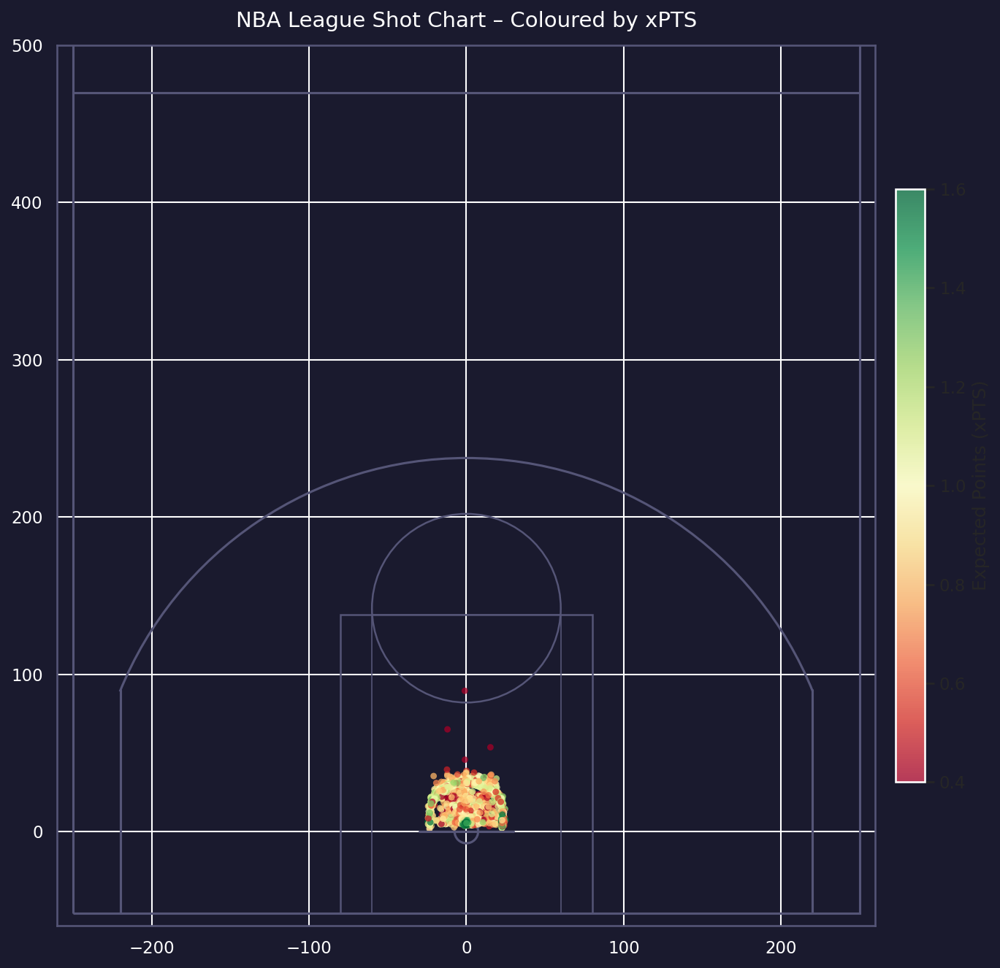
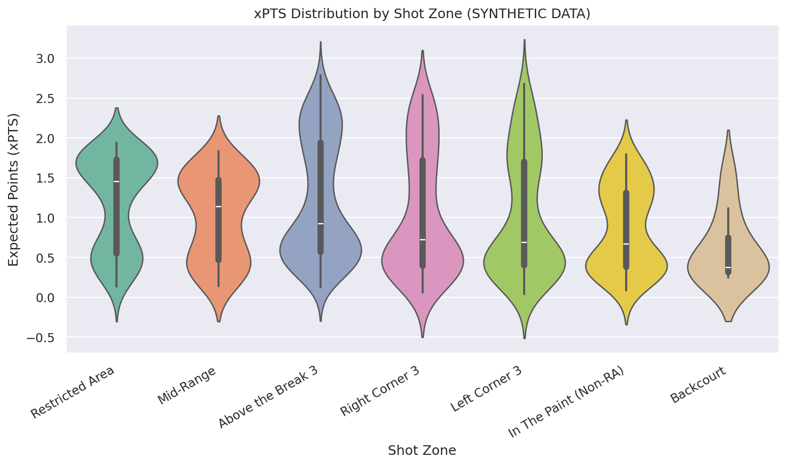
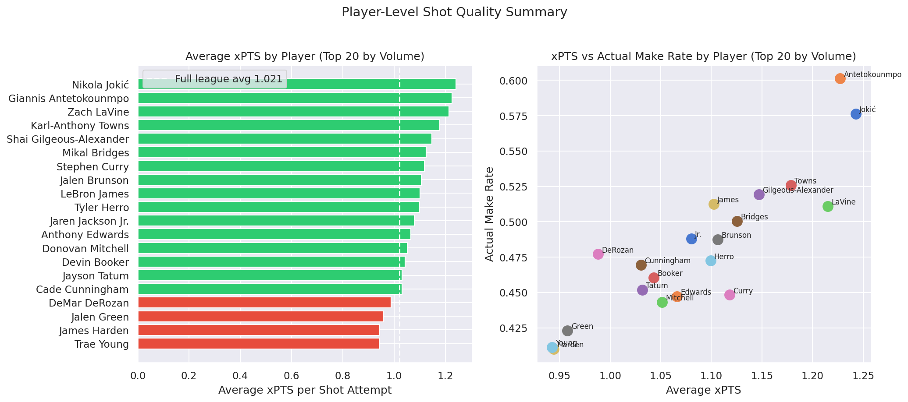

# xPTS Shot Quality Model Report (Real 2025 NBA Data)

**Author:** Amin9666  
**Project:** Expected Points (xPTS) for NBA shot quality  
**Data snapshot used in this report:** `NBA_2025_Shots.csv.zip` → `data/processed/shots_model_input.csv` (**219,527** shots)

## 1. Overview

This rebuild uses the uploaded full-league 2025 shot data and compares **XGBoost** vs **Logistic Regression** on shot make prediction, then converts make probabilities to expected points:

$$
\text{xPTS} = P(\text{make}) \times \text{shot value}
$$

## 2. Data Snapshot

- Total shots: **219,527**
- Overall make rate: **46.72%**
- Average shot value: **2.421**
- Average modeled xPTS: **1.057**

Largest shot zones:

- **Above the Break 3:** 68,358 shots, make rate 35.32%, avg xPTS 0.996
- **Restricted Area:** 61,190 shots, make rate 66.36%, avg xPTS 1.377
- **In The Paint (Non-RA):** 44,475 shots, make rate 44.37%, avg xPTS 0.862

Shot type summary:

- **2PT Field Goal:** 127,073 shots, make rate 54.51%, avg xPTS 1.097
- **3PT Field Goal:** 92,454 shots, make rate 36.02%, avg xPTS 1.000

## 3. XGBoost vs Linear Regression (Hold-out Test)

| Model | ROC-AUC | PR-AUC | Log-Loss | Brier | ECE |
|---|---:|---:|---:|---:|---:|
| XGBoost | 0.6434 | 0.6384 | 0.6513 | 0.2300 | 0.0262 |
| Logistic Regression | 0.6394 | 0.6168 | 0.6557 | 0.2318 | 0.0160 |

Key differences:

- **XGBoost wins discrimination/error metrics** (ROC-AUC, PR-AUC, Log-Loss, Brier).
- **Logistic Regression is better calibrated** (lower ECE).
- Both models are materially stronger on this real dataset than earlier synthetic runs.

## 4. Parameter Importance

Top permutation importances (XGBoost, mean ROC-AUC drop):

1. `player_zone_fg_pct` (0.1057)
2. `shot_angle` (0.0063)
3. `shot_distance` (0.0035)
4. `dist_angle_ix` (0.0023)
5. `game_seconds_remaining` (0.0022)

Interpretation: player-zone shooting history dominates, with spatial geometry and game context as secondary drivers.

## 5. Graphs

### Model comparison visuals

### Feature/parameter importance visuals

### Shot quality and outcome visuals

## 6. Conclusion

Using the uploaded 2025 real NBA dataset, the pipeline now produces a robust league-scale xPTS report. XGBoost delivers slightly better ranking and error performance, while linear/logistic regression remains more reliable for calibration-sensitive use cases.

## Appendix: Sources

- Pipeline: `run_pipeline.py`
- Metrics table: `outputs/model_metrics.csv`
- XGBoost CV summary: `outputs/cv_results_xgboost.csv`
- Permutation importance: `outputs/permutation_importance.csv`
- Player summary: `outputs/player_summary.csv`
